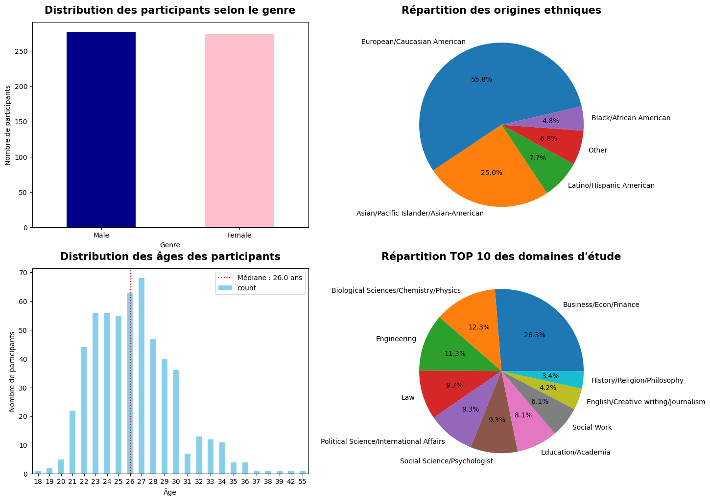
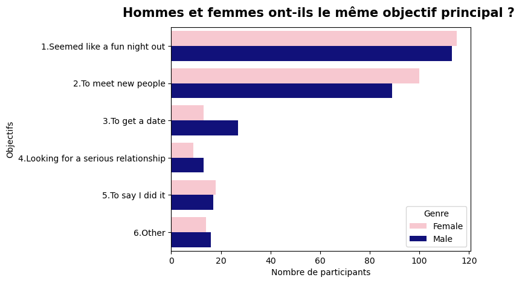
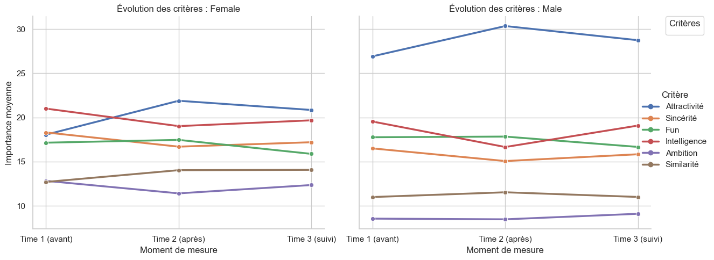
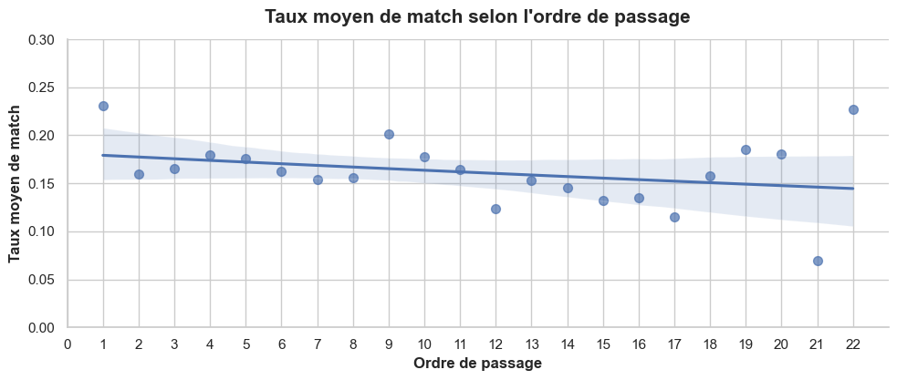
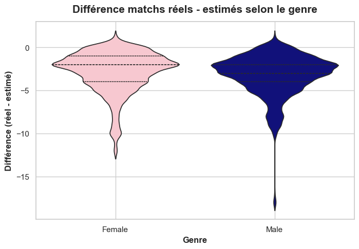
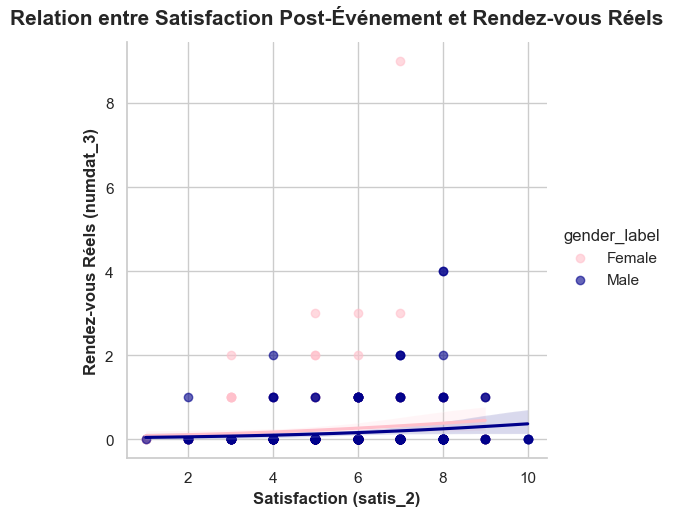

# Analyse Speed Dating  
### Projet Data Analysis – Analyse Exploratoire (EDA)

---

## Contexte

Ce projet a été réalisé dans le cadre d’un travail personnel en **data analysis**, à partir de données issues d’expériences de *speed dating* menées entre 2002 et 2004.

Chaque ligne du jeu de données correspond à une rencontre entre deux participants. À l’issue de chaque rendez-vous, les participants indiquent s’ils souhaitent ou non se revoir, et évaluent leur partenaire selon plusieurs attributs.

Ce contexte expérimental permet d’analyser les mécanismes de décision à l’œuvre lors de rencontres rapides, dans une logique proche de celle des applications de rencontre modernes.

---

## Problématique

**Quels sont les facteurs qui influencent réellement l’obtention d’un match lors d’une rencontre ?**

---

## Sommaire 
- [Analyse Speed Dating](#analyse-speed-dating)
    - [Projet Data Analysis – Analyse Exploratoire (EDA)](#projet-data-analysis--analyse-exploratoire-eda)
  - [Contexte](#contexte)
  - [Problématique](#problématique)
  - [Sommaire](#sommaire)
  - [Objectifs du projet](#objectifs-du-projet)
  - [Source des données](#source-des-données)
  - [Technologies utilisées](#technologies-utilisées)
    - [Langage](#langage)
    - [Librairies](#librairies)
    - [Environnement](#environnement)
  - [Architecture du projet](#architecture-du-projet)
  - [Description du notebook](#description-du-notebook)
    - [cleaning\_\&\_EDA\_tinder.ipynb](#cleaning__eda_tinderipynb)
      - [Nettoyage du jeu de données](#nettoyage-du-jeu-de-données)
      - [Analyse exploratoire des données (EDA)](#analyse-exploratoire-des-données-eda)
      - [Conclusion](#conclusion)
  - [Visualisations clés de l’analyse](#visualisations-clés-de-lanalyse)
    - [Profil des participants](#profil-des-participants)
    - [Priorités déclarées](#priorités-déclarées)
    - [Le facteur déterminant](#le-facteur-déterminant)
    - [Conteste externe](#conteste-externe)
    - [Succès sur le marché](#succès-sur-le-marché)
    - [Précision et satisfaction](#précision-et-satisfaction)
  - [Résultats clés](#résultats-clés)
  - [Limites et perspectives](#limites-et-perspectives)
    - [Limites](#limites)
    - [Perspectives](#perspectives)
  - [Licence](#licence)


---

## Objectifs du projet

Réaliser une analyse exploratoire afin de mieux comprendre les mécanismes de sélection menant à un match, structurée autour de cinq axes principaux :

- **Préambule** : profil des participants en termes d’âge, de genre et d’origines ethniques
- **Priorités déclarées** : Les hommes et les femmes cherchent ils la même chose chez un partenaire ? 
- **Le facteur déterminant** : L'attractivité a-t-elle un impact réel plus fort que les intentions déclarées ?
- **Le contexte externe** : L'ordre de passage et les facteurs démographiques affectent-ils le taux de match ? 
- **Le succès sur le marché**  : La capacité à matcher est-elle simplement liée à l'attractivité perçue ? 
- **Précision et satisfaction**  : Les participants peuvent-ils prédire leur succès et la satisfaction mène t'elle à de vrais rendez-vous ? 
-**Conclusion**  

L’objectif est de produire des visualisations claires et des enseignements exploitables, fondés sur des statistiques descriptives et une analyse exploratoire rigoureuse.

---

## Source des données

Les données proviennent du dataset public suivant :

🔗 Speed Dating Experiment
https://www.kaggle.com/datasets/annavictoria/speed-dating-experiment

Période couverte : 2002–2004

Fichiers utilisés :
- Speed+Dating+Data.csv
- Speed+Dating+Data+Key.doc

---

## Technologies utilisées

### Langage
- Python

### Librairies
- pandas
- numpy
- seaborn
- matplotlib

### Environnement
- Jupyter Notebook
- Visual Studio Code
- Git / Github

---

## Architecture du projet

```text
TINDER/
├── Scripts/
│ ├── Speed+Dating+Data.csv
│ └── Speed+Dating+Data+Key.doc
│ └── Speed_Dating.ipynb
│
├── visualisations/
│ └── screenshots/
│
├── requirements.txt
├── README.md
└── .gitignore
```

---

## Description du notebook

### cleaning_&_EDA_tinder.ipynb

Le notebook est structuré en trois grandes parties.

#### Nettoyage du jeu de données
- Inspection initiale du dataset
- Nettoyage et normalisation des noms de colonnes
- Mapping des variables catégorielles
- Analyse et gestion des valeurs manquantes
- Vérification des doublons et des types de variables
- Exclusion de certaines vagues non comparables

#### Analyse exploratoire des données (EDA)
- Profil des participants (âge, genre, origines, domaine d'études)
- Les priorités déclarées selon les genres
- Le facteur déterminant
- Le contexte externe
- Le succès sur le marché
- Précision et satisfaction 

#### Conclusion
---

## Visualisations clés de l’analyse

Les visualisations précédentes permettent de dégager plusieurs enseignements majeurs, synthétisés ci-dessous.

### Profil des participants



La majorité des participants sont de jeunes adultes âgés de 20 à 30 ans.  
Les distributions d’âge sont relativement similaires entre les genres, avec des femmes légèrement plus jeunes que les hommes.

### Priorités déclarées



### Le facteur déterminant 



Un écart notable apparaît entre les critères déclarés comme importants et ceux ayant un impact réel sur l’obtention d’un match.  
Si l’attractivité reste déterminante, des critères comme l’amusement ou les intérêts partagés présentent un impact réel plus élevé que ce que les déclarations initiales laissaient supposer

### Conteste externe 



### Succès sur le marché




### Précision et satisfaction 



---

## Résultats clés

- Les participants sont majoritairement de jeunes adultes (20–30 ans)
- L’attractivité est un critère important, mais ne suffit pas à expliquer seule l’obtention d’un match
- Les rencontres ayant abouti à un match présentent surtout des notes élevées en intelligence, sincérité et amusement
- Un écart notable existe entre les préférences déclarées et les décisions réellement prises
- Les effets du genre, de l’âge et de l’origine ethnique existent mais restent modérés
- Le succès d’une rencontre repose sur une combinaison de facteurs plutôt que sur un critère unique

---

## Limites et perspectives

### Limites
- Données issues d’un contexte spécifique de speed dating universitaire
- Résultats non directement généralisables aux applications de rencontre actuelles
- Les corrélations observées ne permettent pas d’établir des relations causales.

### Perspectives
- Modélisation prédictive de la probabilité de match
- Analyse approfondie selon l’objectif déclaré des participants
- Comparaison avec des données plus récentes ou issues d’applications modernes

---

## Licence

Projet réalisé à des fins pédagogiques, utilisant exclusivement des données publiques.
